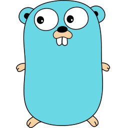

# Go Gin Boilerplate

<div>




[Swagger Api Document](https://go-gin-boilerplate.gganbu.services/swagger/index.html)

</div>

## Introduction

A development boilerplate based on the Gin framework, aimed at helping developers quickly build and develop web applications.

- [English](./README_en.md)
- [中文介绍](./README.md)

## Keywords

[Go](https://github.com/golang/go)
[Gin](https://github.com/gin-gonic/gin)
[Viper](https://github.com/spf13/viper)
[Gorm](https://github.com/go-gorm/gorm)
[Gin-Swagger](https://github.com/swaggo/gin-swagger)
[Air](https://github.com/cosmtrek/air)
[Logrus](https://github.com/sirupsen/logrus)
[Lumberjack](https://github.com/natefinch/lumberjack)
[Jwt](https://github.com/golang-jwt/jwt)

## Features

- **Rapid Development**: Accelerate project development and iteration using the Gin framework and related tools.
- **Simple and Easy to Use**: Follow the [project-layout](https://github.com/golang-standards/project-layout/tree/master) specification, providing a clear and simple code structure that even beginners can easily understand.
- **Integrated Logging System**: Integrated Logrus and Lumberjack for comprehensive log recording and management.
- **Hot Reload**: Utilize the Air tool for hot reloading, improving development efficiency.
- **Database Support**: Integrated Gorm, supporting mainstream databases such as MySQL, PostgreSQL, etc.
- **Flexible Middleware**: Incorporate common middleware for easy implementation of features such as logging, authentication, cross-origin resource sharing (CORS), rate limiting, etc.

## Quick Start

```sh
git clone https://github.com/sanjayheaven/go-gin-boilerplate.git
cd go-gin-boilerplate
go mod download
```

### Configuration Setup

- Navigate to the `configs` directory, copy the `config.example.yaml` file, and rename it to `config.yaml`.

```sh
cp configs/config.example.yaml configs/config.yaml
```

- Modify the configuration items in the `config.yaml` file.

```sh
vi configs/config.yaml
```

### Run the Application

- Run the project using [air](https://github.com/cosmtrek/air) **【Recommended】**

```sh
air
```

- Run the project using [go run](https://golang.org/cmd/go/#hdr-Compile_and_run_Go_program)

```sh
go run cmd/main.go
```

## Deployment

### docker-compose

Deploy the application using **_docker-compose_**.
Ensure that Docker is installed on the server, and you are familiar with the usage of docker compose.

- Copy the [docker-compose.yml](./deployments/docker-compose.yml) configuration file to the project root directory.
- Execute the following command to start the application

```sh
docker compose up -d
```

## Support 🫶

- Star 🌟 the project
- Welcome to submit [issue](https://github.com/sanjayheaven/go-gin-boilerplate/issues). Thank you for your support
- Help promote it on social media and recommend it to friends

  [](https://twitter.com/intent/tweet?text=Wow:&url=https%3A%2F%2Fgithub.com%2Fsanjayheaven%2Fgo-gin-boilerplate)
  [](https://www.facebook.com/sharer/sharer.php?u=https%3A%2F%2Fgithub.com%2Fsanjayheaven%2Fgo-gin-boilerplate)
  [](https://api.whatsapp.com/send?text=Wow:%20https%3A%2F%2Fgithub.com%2Fsanjayheaven%2Fgo-gin-boilerplate)
  [](https://t.me/share/url?url=https%3A%2F%2Fgithub.com%2Fsanjayheaven%2Fgo-gin-boilerplate)

- You can also sponsor a cup of coffee on [Ko-Fi](https://ko-fi.com/dorvan) or [Buy Me A Coffee](https://www.buymeacoffee.com/dorvan)

  <a href='https://ko-fi.com/J3J1T95FG' target='_blank'></a>
  <a href="https://www.buymeacoffee.com/dorvan" target="_blank"></a>
